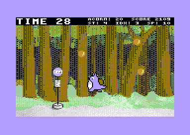

# totoro64
A Studio Ghibli inspired fan game for the Commodore 64

Help chu-totoro catch the acorns before the timer expires.
Good for kids to learn coding while having fun.

The game fits on a standard 16K Commdore 64 cartridge.
Can be played with VICE if the real HW is not avaiable.

# building
to build the game cc65, make and zopfli are required.
just type make to build.
type make test to build and invoke VICE to test the game.

# graphics editors
three different editors have been used for the artwork.
VChar64 for the charset, cbm prg studio for the sprites and
multipaint for the backgorund.
