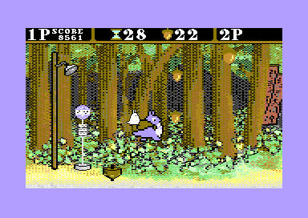

# Totoro64
A Studio Ghibli inspired fan game for the Commodore 64

Help chu-totoro catch the acorns before the timer expires.
Avoid the poison berries and catch the bonus apples.
Single player and two player cooperative mode.
Good for kids to learn coding while having fun.
'V', 'N' and left-shift or joystick in port 2 to play.
In two player mode, the second player uses joystick in port 1.

The game fits on a standard 16K Commdore 64 cartridge.
Can be played with VICE if the real HW is not avaiable.

# Building
To build the game cc65, a GNU compatible make and zopfli are required.
just type make to build.
Type make test to build and invoke VICE to test the game.
The makefile will build the PAL and NTSC version of the game automatically.
There are a few compile time options in the totoro.h header file.
#define STAGE_TIME 60
default time for the stages. Can be any number from 1 to 99
#define SPRITE_MESSAGES
use sprites for most on screen messages 
#define MOVIE_TITLE
use a font similar to the movie for the title screen

The makefile will also build two slightly different layouts.
The 'normal' layout uses a standard multicolor bitmap for the
entire screen. The 'HIRES' layout uses a raster irq to split
the screen in a non multicolor text mode area in the first
16 scanlines to display high resolution text.

# Graphics editors
Three different editors have been used for the artwork.
VChar64 for the charset, cbm prg studio for the sprites and
multipaint for the backgorund.

# Implementation details
Chu-totoro is made up of 3 layered sprites. Two single color for the black outline and the blue details. One multicolor to fill in the bag and the white belly.
Chibi-totoro is made up of 2 single color layered sprites.
One sprite is reserved for the spin top and potential additional game items.
The two remaining sprites are used by the multiplexer to display up to 8 falling items.

The music player is implemented using a custom IRQ player that is locked to VSYNC. The game has correction for PAL and NTSC timing for both playback speed and pitch.

Most game assets are compressed to fit into the 16K cartridge limit. Decompression is done in the title screen using the cc65 zlib routines.

In the hires game mode the IRQ to do split screen is not perfectly stable. A black line between the hires and the multicolor sections is used to hide the artifacts. In hires mode additional sprite multiplexing is used to display the icons in the status bar.
