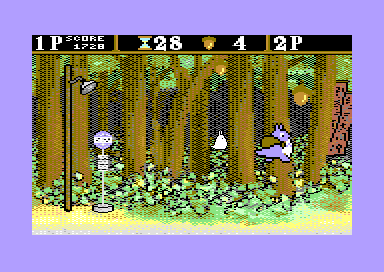

# totoro64
A Studio Ghibli inspired fan game for the Commodore 64

Help chu-totoro catch the acorns before the timer expires.
Avoid the poison berries and catch the bonus apples.
Single player and two player cooperative mode.
Good for kids to learn coding while having fun.
'A', 'D' and shift or joystick in port 2 to play.
In two player mode keyboard input is disabled.

The game fits on a standard 16K Commdore 64 cartridge.
Can be played with VICE if the real HW is not avaiable.

# building
to build the game cc65, make and zopfli are required.
just type make to build.
type make test to build and invoke VICE to test the game.
The makefile will build the PAL and NTSC version of the game automatically.
There are a few compile time options in the totoro.h header file.
#define STAGE_TIME 60
default time for the stages. Can be any number from 1 to 99
#define SPRITE_MESSAGES
use sprites for some on screen messages 
#define MOVIE_TITLE
use a font similar to the movie for the title
#define TWO_PLAYER
enable two player mode (disables keyboard input)

# graphics editors
three different editors have been used for the artwork.
VChar64 for the charset, cbm prg studio for the sprites and
multipaint for the backgorund.
